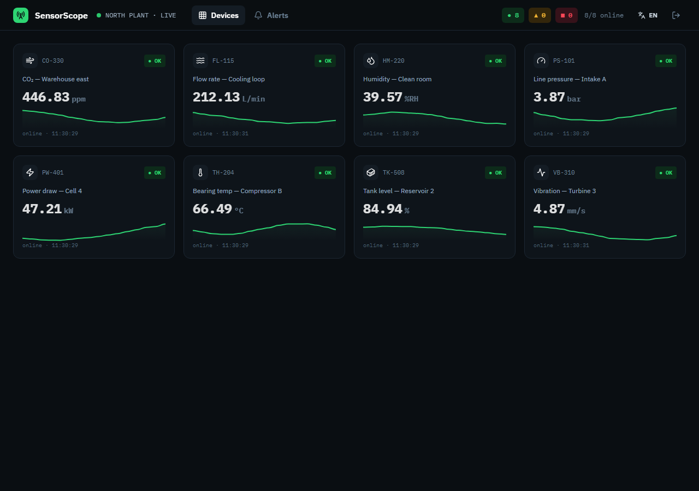
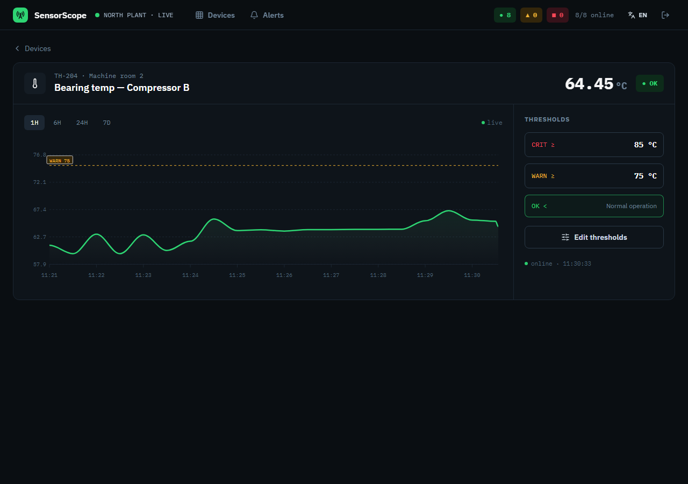
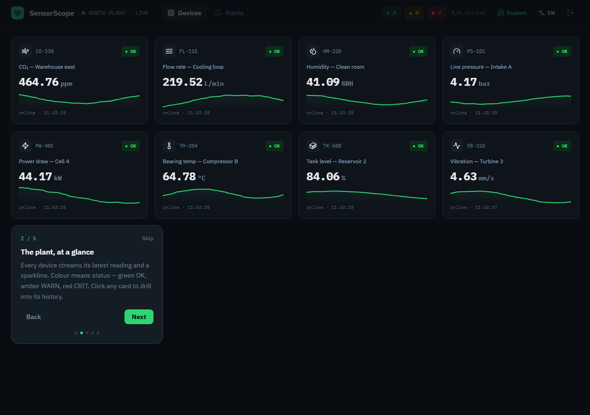
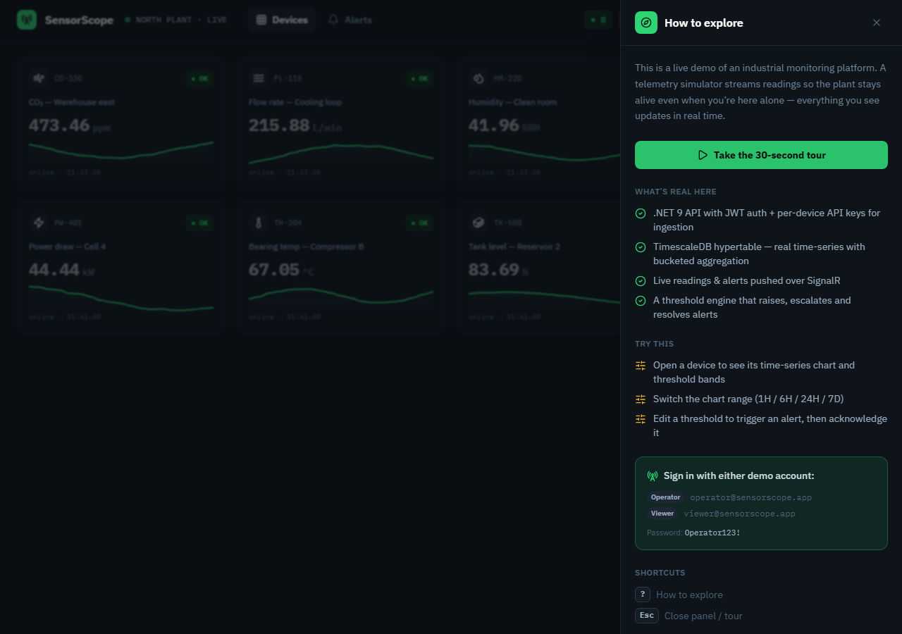

# SensorScope — real-time industrial IoT monitoring

A **control room for industrial telemetry**: per-device reading ingestion, **live time-series charts** and
**configurable threshold alerts**. Readings land in a **TimescaleDB hypertable** and are aggregated with
`time_bucket`; a **threshold engine** raises, escalates and resolves alerts; and everything is pushed to the
browser over **.NET SignalR**. Built as a portfolio piece with production-grade auth, per-device ingestion
keys, tests, and a guided demo layer whose **telemetry simulator keeps the plant alive** for a solo visitor.

> **Status:** complete and runnable end-to-end locally. Cloud deploy is intentionally deferred (batched
> with the rest of the portfolio).

---

## Highlights

- **Live telemetry** — readings stream in over SignalR; device values, alert levels and sparklines update
  instantly across the dashboard.
- **Real time-series** — a TimescaleDB **hypertable** partitions readings by time; series queries use
  `time_bucket` per range (1H→30s, 6H→2m, 24H→10m, 7D→1h).
- **Threshold engine** — crossings raise alerts, **escalate WARN→CRIT** (resolving the old one), and resolve
  automatically on return to OK; the device’s denormalized state recomputes each reading.
- **Tunable thresholds** — retune WARN/CRIT and trigger direction (Above/Below) per device, with validation;
  the current level recomputes immediately.
- **Two-tier auth** — JWT access + **rotating refresh tokens** with brute-force lockout for operators, and
  **SHA-256 API keys** for device ingestion (`POST /api/ingest`).
- **Guided live demo** — a coach-mark tour, a “How to explore” panel, and a server-side **telemetry
  simulator** (BackgroundService) so the demo breathes even when you’re alone.
- **Polish** — dark-only “control-room” design, **EN/ES** i18n, responsive (390/768/1280), and careful
  loading/empty/error states.

## Screenshots

| Live dashboard | Device detail (time-series + thresholds) |
|---|---|
|  |  |

| Guided tour | “How to explore” panel |
|---|---|
|  |  |

## Stack

| Layer | Tech |
|---|---|
| Frontend | Angular 20 (standalone + signals), Tailwind v4, ApexCharts, @microsoft/signalr |
| Backend | .NET 9 Web API, SignalR hubs, Clean Architecture |
| Time-series | TimescaleDB (PostgreSQL) hypertable + `time_bucket` aggregation |
| Ingestion | Per-device API keys (SHA-256) + REST ingest + threshold engine |
| Auth | JWT access + rotating refresh, brute-force lockout |
| Testing | 29 backend unit tests (xUnit) + Playwright E2E (auth, monitoring, tour) |

## Run it locally

**Prerequisites:** .NET 9 SDK, Node 20+, Docker (for TimescaleDB).

```bash
# 1. TimescaleDB (PostgreSQL + time-series extension), port 5433
docker compose up -d timescaledb

# 2. Backend — migrates, promotes 'readings' to a hypertable, and seeds on first run
cd backend
ASPNETCORE_ENVIRONMENT=Development dotnet run --project src/SensorScope.Api   # → http://localhost:5192 (/health)

# 3. Frontend
cd frontend
npm install
npm start                                                                     # → http://localhost:4200
```

Open http://localhost:4200 and sign in with a demo account. The plant is live — a simulator streams readings
every couple of seconds, so values move, charts grow and alerts fire on their own.

### Demo accounts

| Role | Email | Password |
|---|---|---|
| Operator | `operator@sensorscope.app` | `Operator123!` |
| Viewer | `viewer@sensorscope.app` | `Operator123!` |

Device ingestion keys follow `sk-<device-code-lowercase>` (e.g. `sk-th-204`).

### Send a reading (device ingestion)

```bash
curl -X POST http://localhost:5192/api/ingest \
  -H "X-Api-Key: sk-th-204" -H "Content-Type: application/json" \
  -d '{"value": 95}'      # → crosses CRIT for TH-204; watch the alert raise live
```

## Tests

```bash
# Backend unit tests (in-memory; no DB needed)
cd backend && dotnet test

# Frontend E2E (needs the API on :5192 + TimescaleDB; starts the web app itself)
cd frontend && npx playwright test
```

## Documentation

- [`docs/PHASES.md`](docs/PHASES.md) — phase-by-phase build log.
- [`TECHNICAL.md`](TECHNICAL.md) — architecture deep-dive (hypertable, time_bucket, threshold engine, SignalR).

---

Built by **Luis Chiquito Vera** as part of a software-engineering portfolio.
